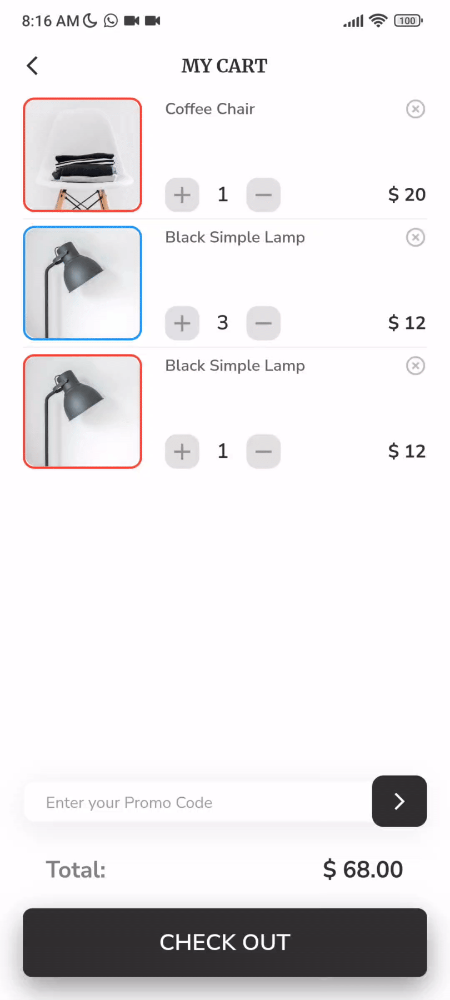
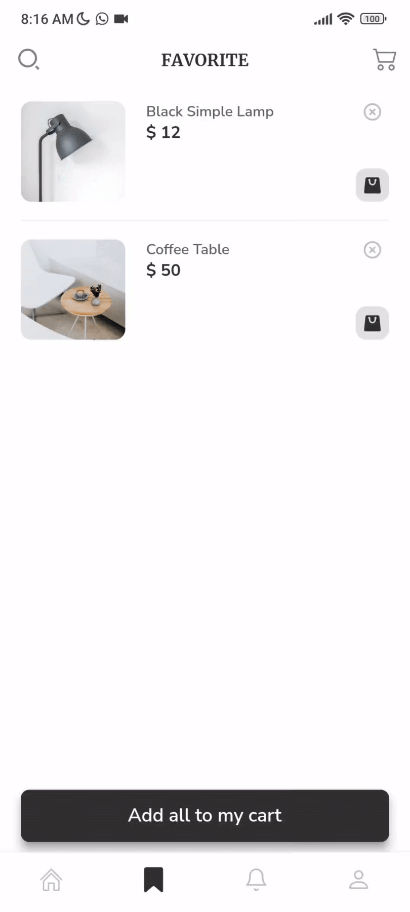
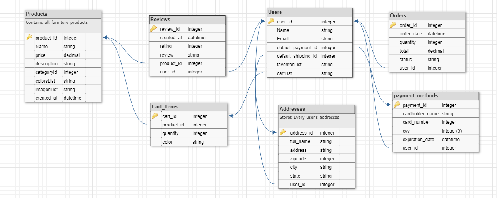

#  🛌 Flutter Furniture App (Timberr) 🪑

Timberr is a robust and feature-rich furniture application clone meticulously crafted using Flutter, Supabase, and Getx State Management. This app seamlessly integrates a sophisticated UI design to provide users with an immersive and intuitive furniture shopping experience.

This app is based on this [UI Design](https://www.figma.com/file/dTdGEtZoQd2uRZc8qS5xjr/Timberr?node-id=0%3A1).

## ✨ Key Features:

- 🔐 Authentication: Timberr ensures a secure and personalized experience with a robust authentication system, allowing users to create accounts, log in securely, and manage their profiles effortlessly.

- 🛒 Cart: The app features a fully functional shopping cart, enabling users to add, remove, and manage items with ease. The cart ensures a smooth and efficient checkout process for a seamless shopping journey.

- 💖 Favorites: Timberr incorporates a favorites section, allowing users to curate a personalized list of preferred items. This feature enhances user engagement by providing a quick and convenient way to revisit and purchase favored products.

- 🗺️ Address: Users can effortlessly manage their delivery addresses, ensuring a hassle-free and customized shopping experience. The address feature enhances convenience by enabling users to save and update their preferred delivery locations.

- 🔍 Search and Filtering: Timberr integrates a powerful search functionality and advanced filtering options, facilitating users in discovering desired furniture items efficiently.

- 🌈 Select Color: Users can customize their furniture selection by choosing from a variety of colors, adding a touch of personalization to their shopping experience.

- 💳 Payment Methods: The app supports multiple payment methods, ensuring a secure and versatile checkout process for users. This feature includes integration with the Razorpay payment gateway for a seamless and reliable transaction experience.

- 👤 User Profile Management: Timberr empowers users to personalize their profiles by enabling them to change profile pictures, update names, passwords, and other user-related settings, enhancing the overall user experience.

- 💫 Smooth Animations: The app incorporates smooth and visually appealing animations, enhancing the overall user interface and providing a delightful interaction experience.

- 🚧 Reviews, Orders, and Notifications: While currently implemented as UI elements, Timberr sets the foundation for future functionality, allowing users to access and view product reviews, order history, and notifications – enhancing user engagement and information accessibility.

## 💻 Installation links

## 📸 Screen Recordings

<b>Authentication</b>

&nbsp;&nbsp;&nbsp;&nbsp;&nbsp;&nbsp;

 

<b>Cart</b>

&nbsp;&nbsp;&nbsp;&nbsp;&nbsp;&nbsp;

 

<b>Favorites</b>

&nbsp;&nbsp;&nbsp;&nbsp;&nbsp;&nbsp;

 

<b>Address</b>

&nbsp;&nbsp;&nbsp;&nbsp;&nbsp;&nbsp;

 

<b>Searching and Filtering</b>

&nbsp;&nbsp;&nbsp;&nbsp;&nbsp;&nbsp;

 

<b>Payment</b>

&nbsp;&nbsp;&nbsp;&nbsp;&nbsp;&nbsp;

 

<b>Account Settings and Notifications</b>

&nbsp;&nbsp;&nbsp;&nbsp;&nbsp;&nbsp;

 

<b>Reviews</b>

&nbsp;&nbsp;&nbsp;&nbsp;&nbsp;&nbsp;

 

<b>Orders and Sign-out</b>

&nbsp;&nbsp;&nbsp;&nbsp;&nbsp;&nbsp;

 

## 🗃️ Database Schema

## 🔌 Plugins

| Name                                                                      | Usage                                            |
|---------------------------------------------------------------------------|--------------------------------------------------|
| [**get**](https://pub.dev/packages/get)                                   | Dependency injection, State and Route management |
| [**supabase_flutter**](https://pub.dev/packages/supabase_flutter)         | Authentication, Database and Storage             |
| [**cached_network_image**](https://pub.dev/packages/cached_network_image) | Caching Product and user images                  |
| [**lottie**](https://pub.dev/packages/lottie)                             | Loading Animations                               |
| [**url_launcher**](https://pub.dev/packages/url_launcher)                 | To open FAQ in a browser                         |
| [**image_picker**](https://pub.dev/packages/image_picker)                 | To select user profile picture from their device |
| [**razorpay_flutter**](https://pub.dev/packages/razorpay_flutter)         | Payment Gateway through Razorpay                 |
| [**flutter_lints**](https://pub.dev/packages/flutter_lints)               | For linting                                      |

## 📃 Feature Todo List

- [x] Authentication
- [x] Cart
- [x] Favorites
- [x] Address
- [x] Search
- [x] Filtering
- [x] Select Color
- [x] Change Quantity
- [x] Payment Methods
- [x] Razorpay Payment Gateway
- [x] Change User Profile Picture
- [x] Change Name/Password and other User Related Settings
- [x] Smooth Animations
- [x] Loading Screens
- [ ] Reviews (Only UI implemented)
- [ ] Orders (Only UI implemented)
- [ ] Notifications (Only UI implemented)
- [ ] Dark Mode
- [ ] Responsive Design (Only Mobile version implemented)

## 🤓 Author

**[Aditya R](https://github.com/adeeteya)**

## 🔖 LICENCE
Copyright (c) 2022 Aditya R
[MIT LICENCE](https://github.com/adeeteya/FlutterFurnitureApp/blob/master/LICENSE)